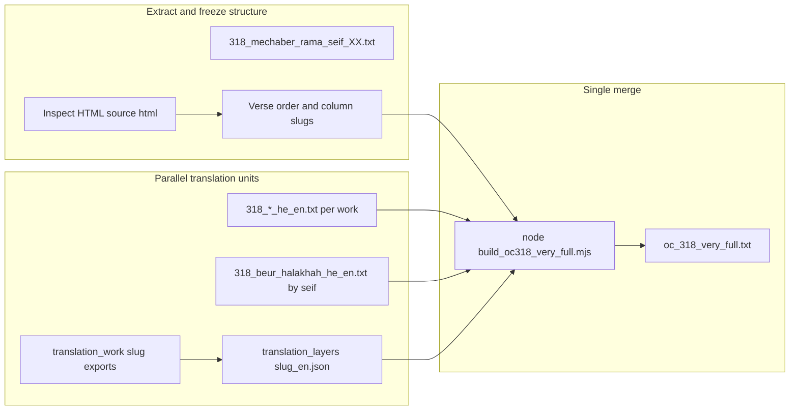

# Pipeline: modular full translation → single merged document

This document describes a repeatable workflow for producing **complete interleaved Hebrew–English texts** without losing coherence: work is split by **commentary**, **marker**, or **seif**, merged only at the end into one output file (for OC 318: `oc_318_very_full.txt`).

---

## Goals

| Goal | How the pipeline supports it |
|------|------------------------------|
| **Full translations done separately** | Each commentary (or logical chunk) lives in its own artifact; translators never edit the megadocument by hand. |
| **Volume managed** | Caps cognitive load: one slug, one marker block, or one seif at a time; optional external round-trip files under `translation_work/`. |
| **Flow preserved** | Structure comes from AlHaTorah HTML (`source html`) + fixed keys (markers / seif numbers); the merge script orders content deterministically. |
| **Single end artifact** | One command produces the complete document after all parts are ready. |

---

## Artifact types (what gets translated where)

### 1. Bilingual section files (`318_*_he_en.txt`)

**Best for:** major commentaries aligned to Tur/Shulchan Arukh letter markers `(א)`, `(ב)`, … as shown on AlHaTorah.

**Format** (parsed by `parseHeEnTxt` in `oc318_html_lib.mjs`):

- Optional header lines, then repeated blocks:
- A line of **80 equals signs** `================================================================================`
- A marker line: `(א)` or `(יא)` etc. (must match HTML `span.num` text without parens in the map key)
- Hebrew paragraph(s)
- **Blank line**
- English translation for that marker only

**Registered in code:** `BILINGUAL_META` and `EXTRA_BILINGUAL_META` inside `build_oc318_very_full.mjs` map **HTML column slug → filename**. Examples: `bach` → `318_bach_he_en.txt`, `or-chadash-tashlum-beit-yosef` → `318_or_chadash_he_en.txt`.

**Volume rule:** Prefer **one file per commentary work**. For an enormous single-marker essay (e.g. one `(א)` spanning many screens), keep **one Hebrew block** but translate in a sidecar draft (`_draft_en.txt`) and paste into the `(א)` English section when complete—still one keyed block in the final file.

### 2. Beur Halakhah by seif (`318_beur_halakhah_he_en.txt`)

**Best for:** works keyed by **Shulchan Arukh seif**, not by letter marker.

**Format:** Headings like `(1)`, `(3)`, … bundling Hebrew then English for that seif. The very-full build matches these to `data-num` on each verse.

**Volume rule:** Translate **one seif block per session**; keeps cross-references inside that seif consistent.

### 3. Translation layers (JSON + optional extract workflow)

**Best for:** commentaries that still use `translation_layers/<slug>_en.json` keyed by seif number and marker string.

**Full-document discipline:**

1. `node export_oc318_translation_stubs.mjs` — ensures stubs / extracts exist.
2. `node export_oc318_commentary_for_external_translation.mjs <slug>` — writes `translation_work/<slug>_OC318_translate.txt` with `<<<HE>>>` / `<<<EN>>>` blocks.
3. Translate **only** inside `<<<EN>>>` (preserve delimiters).
4. `node import_oc318_commentary_from_external_translation.mjs <slug>` — folds English back into JSON.

**Volume rule:** Export **one slug at a time**; finish import before starting another slug if you want clean blame and fewer merge mistakes.

### 4. Kitzur (special case)

Uses `318_kitzur_he_en.txt` plus `kitzur_sections.json` / `kitzur_en_translations.json` — treat as its own mini-pipeline; do not mix edits with marker files.

---

## End-to-end stages

1. **Freeze source:** Keep a saved AlHaTorah export as `source html` (or pass path as CLI arg). Mechaber/Rama lines come from `318_mechaber_rama_seif_XX.txt`.
2. **Choose units:** Assign each commentary to either a `*_he_en.txt` file (preferred for full prose) or the JSON/workflow path.
3. **Translate in isolation:** Small files, one slug or one section list at a time.
4. **Validate locally:** After editing a `*_he_en.txt`, ensure separators and `(marker)` lines still match `parseHeEnTxt` (see checklist below).
5. **Merge:** From `newtryoutput`, run `node build_oc318_very_full.mjs [optional-html-path]`.
6. **Review:** Read build warnings; spot-check first and last seif for each commentary.

---

## Commands reference (OC 318)

| Step | Command |
|------|---------|
| Full merge output | `node build_oc318_very_full.mjs` |
| Default HTML | `source html` in same folder |
| Output file | `oc_318_very_full.txt` |
| Regenerate extracts / stubs | `node export_oc318_translation_stubs.mjs` |
| External round-trip for one slug | `export_oc318_commentary_for_external_translation.mjs` → translate → `import_oc318_commentary_from_external_translation.mjs` |

---

## Volume and corruption control (practical rules)

1. **Never translate in the merged `.txt` output** — it is generated; edits belong in source files only.
2. **One commentary file per commit/session** when possible, so Git diffs stay readable.
3. **Markers are IDs:** English must stay tied to the correct `(א)` / `(ב)`; mixing blocks breaks alignment without necessarily throwing a build error.
4. **Large single markers:** Draft English elsewhere, then paste once; avoids half-updated giant paragraphs.
5. **UTF-8 only:** Save all text files as UTF-8 to avoid mojibake in Hebrew.
6. **Run the build after substantive edits** so missing keys surface as warnings (e.g. missing marker for a seif).

---

## Pre-merge checklist

- [ ] `source html` is the intended AlHaTorah snapshot for this siman.
- [ ] Every `318_*_he_en.txt` opens with the expected separator pattern and each block has **two newlines** between Hebrew and English.
- [ ] `318_beur_halakhah_he_en.txt` uses `(N)` headings for each translated seif you care about.
- [ ] For JSON-based slugs, `import_*` has been run after translation.
- [ ] `node build_oc318_very_full.mjs` completes with **no unexpected warnings** (review `--- Build warnings ---` at end of output file if present).

---

## Extending to another siman or volume

Reuse the same pattern:

1. Copy/adapt `build_oc318_very_full.mjs` → e.g. `build_oc253_very_full.mjs` with new paths, `BILINGUAL_META`, and mechaber file prefix.
2. Keep **one merge script** as the only writer of the final “complete single document.”
3. Keep **translation inputs** small, named, and keyed to DOM slugs or seif numbers from that siman’s HTML.

This keeps full translation work **partitioned**, **reviewable**, and **safe to parallelize**, with a single deterministic assembly step at the end.
